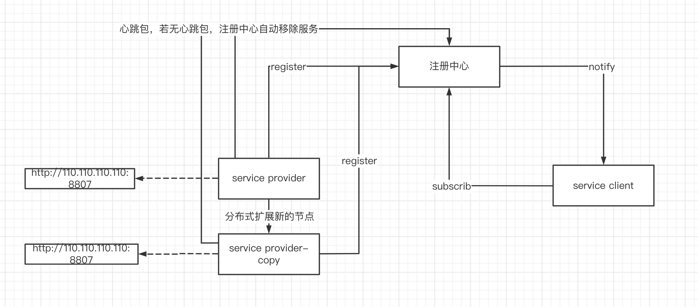
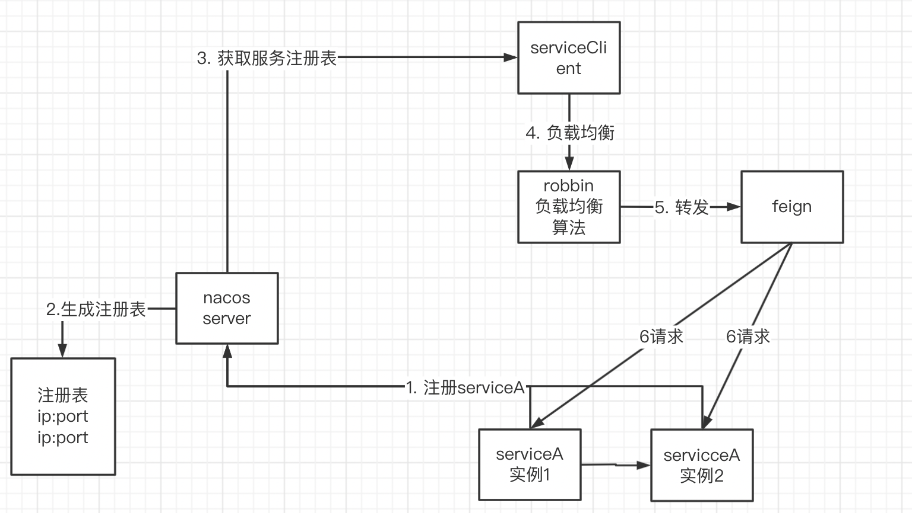
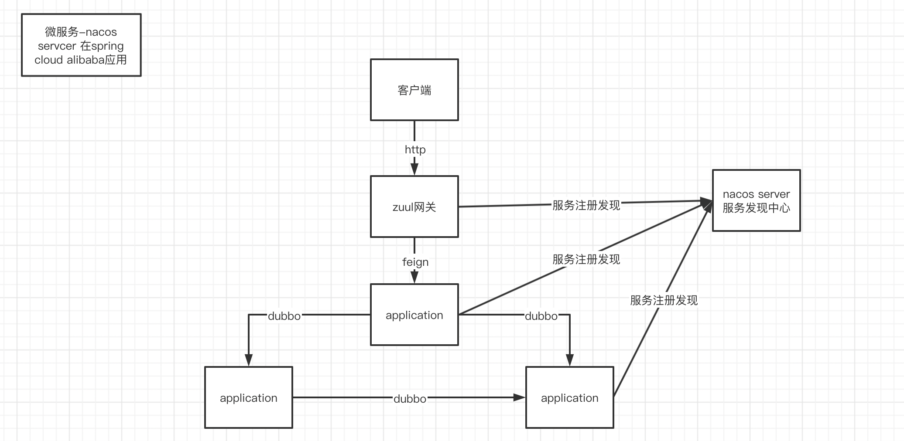

# 微服务Mic-Service

## 一、注册中心

伴随着集群应用的扩展，我们随时可能在分布式系统中对某个服务扩展新的节点（例如：订单服务），这时候对应的和该服务有耦合的服务就需要动态加上相关的节点的地址信息（或者通过代理来分配对应的请求连接），这时候维护成本变得很大，如果能通过注册中心的方法，新增的节点自动通过服务发现的手段，将服务的信息注册到注册中心中，其他服务直接订阅注册中心的配置信息，就能够避免上述的问题了。

### 1. Nacos

​	官方手册：https://nacos.io/zh-cn/docs/quick-start.html

​	教程视频：https://www.bilibili.com/video/BV1Pv411i7ee/?p=13&spm_id_from=pageDriver

- 安装环境
- 安装nacos server
- 修改配置文件将配置信息写入mysql
- 使用接口写入和读出配置信息
- 新建项目，引入pom依赖
- 使用nacos的类获取配置信息

#### 1.1. 配置管理

- namespace/命名空间：不同命名空间是隔离的，例如：环境（dev、prop、test） 或者 每个用户对应一个namespace
- group/分组：几个配置文件归为一个组，对配置文件的分类，例如： 一个系统（mysql、redis、server）
- DataId/配置集：，对应一个配置文件，根据系统需要配置对应需要的配置信息
  - 配置项：配置集合里面包含的配置每个项的信息

##### 1.1.1. 提供版本控制及回滚

##### 1.1.2. 提供监听

​	当配置有变化的时候获取通知

##### 1.1.3. 修改管理的账号密码

- 直接通过nacos的加密方式，覆盖数据库中user表的密码
- 修改nacos的配置文件

##### 1.1.4. 分布式应用配置管理

- 发布配置
- 建立两个微服务
- 都引入spring-cloud-start-alibaba-nacos-config相关依赖
- 配置引导文件bootstrap.yml（bootstrap加载顺序要优先properties），指向nacos server地址并指定读取对应的namespace/group/dataid
- 打印对应的配置值，可以通过@value(${属性名})获取配置信息，此时配置信息会以environment的参数加载进来
- 实时的获取动态的配置信息，application.getEnvinment().getProperties("属性名")
- 一个服务对应多个dataId，不同的groupId（不写默认Default Group）（课13）
- 配置的优先级，若配置含有多个dataId，每个dataId的值若有重复，以dataId的值越大，优先级越高

##### 1.1.5. nacos集群部署

- 复制服务文件
- 修改配置端口
- 修改cluster文件
- 查看节点状态leader

#### 1.2. 服务发现

​	订单服务调用商品服务api获取商品信息，实现生产方和消费方的远程调用，并且检查服务的存活状态，提供注册和通知功能。

##### 1.2.1. spring-cloud服务写作流程

​	课20

- 微服务把自己的地址注册到服务中心，此时nacos server注册表会包含有微服务的注册的地址信息
- 其他service获取nacos注册表
- 其他service通过负载均衡（springcloud-ribbon负载均衡算法）来决定远程调用服务节点
  - 服务端负载均衡：将客户端传过来的请求分摊到各个实例（负载均衡器）
  - 客户端负载均衡：客户端直接决定要请求的服务实例
- 使用spirng-cloud的feign来进行远程调用
  - @feignClient("服务名")可以对标注的对象直接生成一个动态代理对象
  - feign可以直接从服务中心根据@feignClient获取指定服务的实例，来进行远程调用

##### 1.2.2. 搭建微服务

​	课21

- 引入spring-cloud-alibaba的feign，nacos相关依赖
- 配置服务发现配置文件
- @EnableDiscoveryClient允许生产者服务被发现
- @EnableFeignClient允许使用feign作为代理服务器
- 可在nacos服务列表看到服务已经被注册进去了
- 创建消费者并创建feign客户端，指向生产者@FeignClient("")

##### 1.2.3. 多实例的负载均衡

##### 1.2.4. 服务发现的数据模型

- 服务：多个实例其实对应了集群，多个集群对应了服务，所以我们制定feign制定的是服务名，该服务名可能对应多个实例
  - 服务的上线和下线
  - 权重的设置
- 实例
  - 实例：ip:port
  - 元数据

##### 1.2.5. spring-cloud-alibaba综合集成架构

